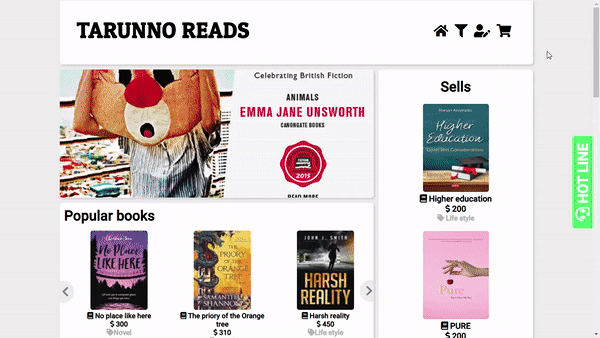
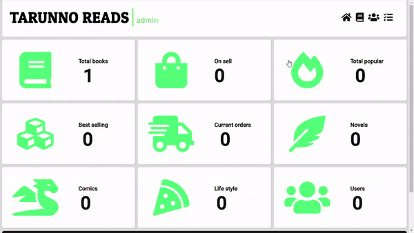
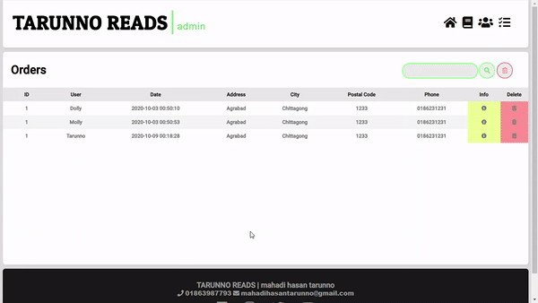

# Book-eCommerce-AJAX

##### For more views go to the Screen shots folder
## Landing page

## Main page

## Cart

## Admin - books

## Admin - Orders

The admin panel has 4 eidting options : users, orders, products management. The admin can remove a member and his/her orders.
admin can add products and update them. Simple eCommerce website for selling books.

### Features : CURD | CMS | AJAX
I have mainly used the concept of CURD and CMS in OOP PHP.
features: 
        1. add, delele update porduct. 
        2. upload products images. 
        3. personal cart to show products one user added. 
        4. Filter products. 
        5. admin panel for the admin to manage the contents. 
        6. Form validations  
        7. intercative database operations. 

### Front-end Features :
In front a i have used vanilla-js for interactivity
and core html, css for markup and style. 
        1. Responsive design.  
        2. Image slide show and nice landing page. 
        3. Carosol slider for products.  
        7. AJAX for interactive backend works. 
              
### Languages : HTML CSS JavaScript PHP and SQL
I have used core HTML CSS JavaScript and PHP in this project. There's no framework used of any of these language.
For front-end I have used HTML CSS JS and for back-end I have used PHP SQL.
I have used XAMPP as local severe and phpMyadmin for Database managment system.

### Requirement : Import the DATABASE.sql file to your phpMyadmin 
